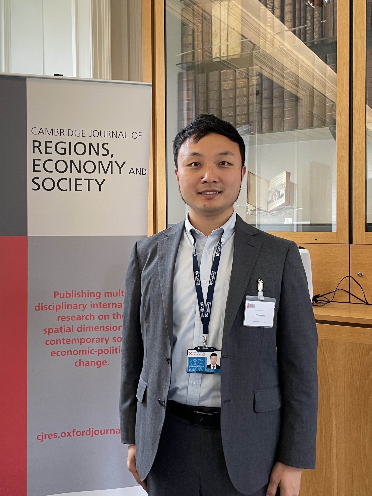

---
#
# By default, content added below the "---" mark will appear in the home page
# between the top bar and the list of recent posts.
# To change the home page layout, edit the _layouts/home.html file.
# See: https://jekyllrb.com/docs/themes/#overriding-theme-defaults
#
layout: base
---


# Chong Liu
# 刘充

```
Institute of Economics, School of Social Sciences, Tsinghua University
清华大学社科学院经济学研究所
220 Mingzhai Building, Tsinghua University, Beijing, China 100084
北京市海淀区清华大学明斋 220 办公室（邮编：100084）
Email: liuchong961230@gmail.com, tylch2@163.com
邮箱：liuchong961230@gmail.com, tylch2@163.com
```

<br/>

<div  align="center"> 

</div>

<br/>

Welcome!

欢迎来到我的学术主页！

I am a Ph.D candidate at Institute of Economics, School of Social Sciences, Tsinghua University.

我是清华大学社科学院经济学研究所的博士候选人。

You can find my CV [here](http://39.98.141.84:3838/iMarxTool/CV_4.0_LaTeX.pdf).

你可以在[这里](http://39.98.141.84:3838/iMarxTool/CV_4.0_LaTeX.pdf)下载我的简历。

My research focuses on Mathematical Marxian Economics and Political Economy.

我的研究领域是数理马克思经济学和政治经济学。

I also have interests in the topics on China’s Economy and the methods of Post-Keynesian Economics.

我也对中国经济问题和后凯恩斯学派方法感兴趣。

I am committed to analyzing problems and proposing solutions from the perspective of Marxist Political Economy while promoting a critical and constructive dialogue with Mainstream Economics.

我致力于从马克思主义政治经济学的视角分析现实问题并提出解决方案，同时推动与主流经济学之间的批判性与建设性的对话。

<br/>
<br/>

## Pulications
## 期刊论文

------

1. Li, Bangxi, <u>Chong Liu</u>, Feng Zhao and Yanghua Huang. 2019. “Production Structure, Income Distribution and Macroeconomic Efficiency: An Analytical Framework and Empirical Study of Marxist Political Economy (in Chinese).” ***Economic Research Journal*** [**TOP** Chinese Journal in Economics], 54 (3): 181-193 [[ERJ2019](http://39.98.141.84:3838/iMarxTool/ERJ2019.pdf)]

    **Abstract**: In the current literature, there is little systematic research on the relationship among adjustment of the income distribution, change in economic structure and improvement of macroeconomic efficiency. This paper expands Marx's reproduction schema into the “Marx–Sraffa” three-department structure table comprising fixed capital, general means of production and means of consumption and employs China's input–output table from 1987 to 2015 to portray the relationship between income distribution and macroeconomic efficiency under investment-driven growth. This paper calculates the wage–profit curve of China's economy and evaluates the space of macroeconomic efficiency improvement in China based on the deviation between actual and potential income distribution structure. The results show that there is a downward trend of the profit rate, which meets Marx's theoretical prediction, and the decline in the profit rate is mainly attributed to an increase in the organic composition of capital arising from the rapid growth of fixed capital investment under extended growth. The analysis of macroeconomic efficiency shows that the space for improving macroeconomic efficiency is extremely limited under traditional growth pattern and that China must transform its economic development pattern and foster new economic growth drivers.

   李帮喜, 刘充, 赵峰, 黄阳华. 生产结构、收入分配与宏观效率——一个马克思主义政治经济学的分析框架与经验研究[J]. [经济研究](http://39.98.141.84:3838/iMarxTool/ERJ2019.pdf), 2019, 54 (3): 181-193.

    **摘要**：现有文献对收入分配调整、经济结构变动和宏观效率提升三者之间的关系鲜有系统性研究。本文将马克思的再生产图式拓展为由固定资本、一般性生产资料、消费资料组成的“马克思—斯拉法”型三部类结构表，并利用中国1987—2015年的投入产出表，刻画投资驱动型增长下收入分配与宏观效率之间的关系。文章测算了中国经济的工资—利润曲线，再根据实际与潜在收入分配结构之间的偏离度，评价了中国宏观效率提升的空间。结果表明，利润率出现了下降的趋势，符合马克思的理论预测；利润率的下降主要归因于外延式增长方式下固定资本投资快速增长引起的资本有机构成提高；对宏观经济效率的分析表明，在传统增长方式之下，改善宏观经济效率的空间极为有限，必须转变经济发展方式，打造经济增长新动能。

   - **Translated into English and Reprinted** in 2021 by _China Political Economy_ , 4 (1): 110-127 [[CPE2021](http://39.98.141.84:3838/iMarxTool/CPE2021.pdf)]
  
        被 *[China Political Economy](http://39.98.141.84:3838/iMarxTool/CPE2021.pdf)* 翻译转载、被中国人民大学复印报刊资料全文转载

   - **Ranked 15th** on Academic Influence among 2,952 Papers **[TOP 0.5%]** in Political Economy in
    China (2012 - 2019)

        入选“中国政治经济学**最具影响力的学术论文**（2012～2019）”**前0.5%**（第15名 / 2952篇学术论文）

2. <u>Liu, Chong</u> and Lirong Jiang. 2022. “The French Regulation School: Core Concepts, Theoretical Evolution and Enlightenment (in Chinese).” ***China Review of Political Economy*** [**TOP Field** Chinese Journal in Economics], 13 (6): 146-174 [[CRPE2022](http://39.98.141.84:3838/iMarxTool/CRPE2022.pdf)]

    **Abstract**: Born in the economic crisis and crisis in economics in the 1970s, the French Regulation School (FRS), theoretically inspired by Marx and other radical economists, advocates studying the capitalist mode of production (CMP) as a historical process with the “Regulation Approach” as a leading paradigm. It is of great significance to examine the achievements and new progress of the FRS. This paper reviews the core concepts and theoretical evolution of the FRS from the perspective of Marx's economics. We find that the institutional forms, mode of regulation, and accumulation regime jointly determine the capitalist economy's self-regulation, self-renewal, and self-development, where five types of crises are also involved. There is a strong continuity of studies among scholars of different generations. The transformation from Fordism to Post-Fordism and exportism as a dominant mode of growth in the East Asian newly industrializing economies (EANICs) has attracted the attention of scholars in the 20th century while emphasizing the central role of the state in regulation is an essential theoretical turn in the 21st century. Regarding methodology, the FRS pays attention to complementary economic and extra-economic mechanisms, integrated micro and macro perspectives, historical induction, and contradiction analysis, all of which have rich reference significance for the innovation of Marxist economics.

    刘充, 姜力榕. 法国调节学派：概念体系、理论演进与启示[J]. [政治经济学评论](http://39.98.141.84:3838/iMarxTool/CRPE2022.pdf), 2022, 13 (6): 146-174.
    
    **摘要**：法国调节学派诞生于20世纪70年代的经济危机与经济学危机，以“调节方法”为分析工具，主张把资本主义生产方式当做一个历史过程予以考察。在经济思想史的谱系中，法国调节学派处于继承和发展马克思经济学的位置，审视法国调节学派的成果和新进展有着重要的理论和现实意义。本文从马克思经济学的视角梳理了法国调节学派的概念体系和理论演进，发现资本主义经济的自我调节、更新、发展可以在制度形式、调节方式和积累体制等构成的概念体系中得到证明，而五类危机也蕴含其中；不同代际学者的研究有较强的延续性，从福特主义向后福特主义的转变以及东亚的新兴工业化经济体的出口主义等问题为20世纪学者所关注，而强调国家在调节中扮演着核心角色是21世纪的重要理论转向。法国调节学派在方法论上兼顾经济和超经济因素、打通经济的微观与宏观、强调历史归纳、坚持矛盾分析法，对创新马克思主义经济学有重要的借鉴意义。

<br/>
<br/>

## Working Papers
## 工作论文

-----

1. Toward a Three-Sectoral Reproduction Model of Fixed Capital Depreciation and Investment-Driven Economic Growth: Theory and Policy Simulations from Chinese Input-Output Data (with Bangxi Li and Jim Huangnan Shen)

    折旧与投资驱动型经济增长的三大部类再生产模型
   
   - Accepted by **ASSA Annual Meeting** 2020 (Oral Presentation)

      口头汇报于**美国经济学会年会**（2020）

   -Available at SSRN: [https://ssrn.com/abstract=3679853](https://ssrn.com/abstract=3679853)

      线上发表于SSRN平台

3. Real Economy and Economic Fictionalization: Theoretical Framework and Indicator Construction (in Chinese, with Bangxi Li and Liang Chen)

    实体经济与虚拟化问题研究：理论框架与指标构建（合作者：李帮喜、陈亮）

    - **R&R** on **_Social Sciences in China_** [**TOP** Chinese Journal in Social Sciences]

        投稿在《中国社会科学》并获得第二轮积极意见

4. Fixed Asset Investment, Accelerated Depreciation and Economic Growth: Theoretical Framework and Empirical Evidence (in Chinese, with Bangxi Li and Feng Zhao)
   
   固定资产投资、加速折旧与经济增长：理论框架与经验证据（合作者：李帮喜、赵峰）

5. Recent Development in Research on Fictitious Capital and Financial Capital (in Chinese)

    虚拟资本与金融资本的研究新进展

6. Comparative Analysis of Economic Growth Research from the Perspective of Production Theory: Enlightenment from Marx and Post-Keynes (in Chinese)

    生产理论视角下经济增长研究的比较分析：马克思、后凯恩斯的启示

<br/>
<br/>


## Work in Progress
## 正在进行

-----

1. Coordinated Development and Spatial Spillover Effect of Macroeconomic Efficiency: An Empirical Study Based on the Provincial Input-Output Tables (in Chinese)

    区域协同发展与宏观效率空间溢出效应：基于分省投入产出表2002～2017的经验研究

2. Marx or Keynes? Revision of the Mathematical Model of Endogenous Public Expenditure (in Chinese, with Bangxi Li and Yi Ge)

    马克思还是凯恩斯？内生化公共支出的数理模型修正（合作者：李帮喜、戈弋）

<br/>
<br/>
